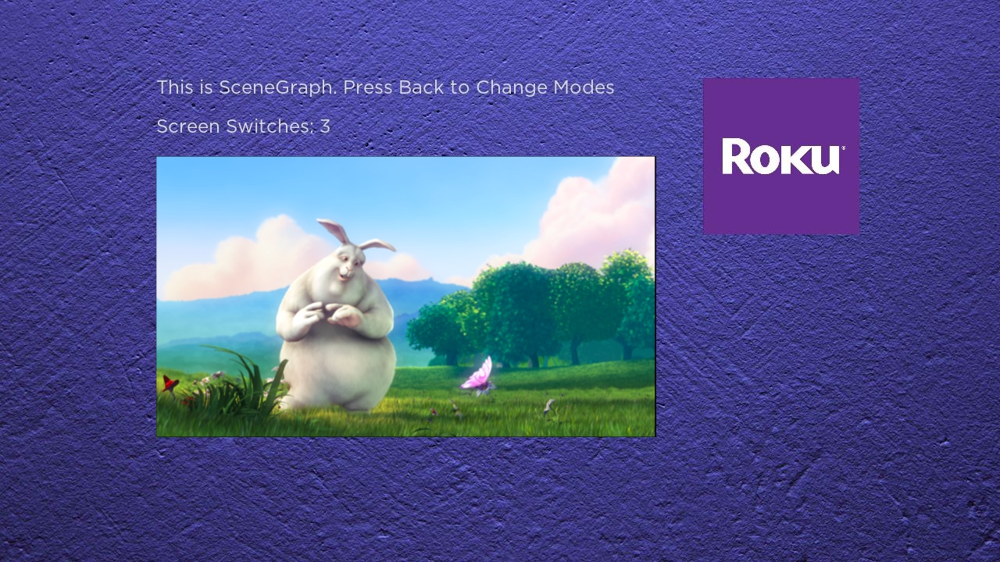
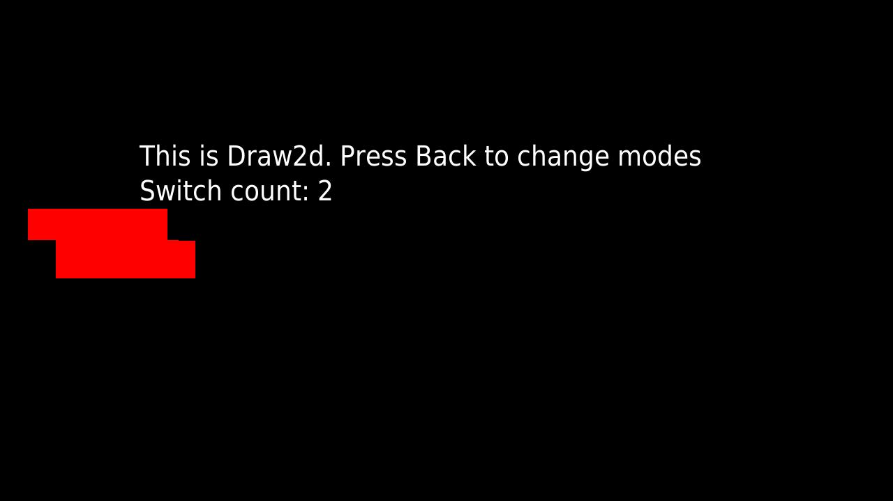

# Example Roku Hybrid App

This shows how to switch back and forth between SceneGraph (`roSGScreen`) and Draw2d (`roScreen`) display modes.

The idea is that only one screen mode is active at any time, but just before the active screen mode is going to be closed, you need to initialize the other kind of screen mode. There may be limits to the amount of times this switch can happen due to memory, etc., but with this example app, I have been able to switch at least 20 times without issue (on a Roku Ultra).

**This has been tested with Roku OS 12. Roku may change the ability to switch modes at any time. There is no guarentee that this method will work in future versions of Roku OS.**

I belive that in the background, SceneGraph uses the same draw canvas as when you use `roScreen` for images, so if the `roScreen` is still active when the Scenegrpah scene is being displayed, images will not appear. That's why it's important to close an active `roScreen` directly after calling `roSGScreen.show()`.






## Install

```
npm install
```

## Build

```
npm run build
```

This will create the file `./out/roku-hybrid-example.zip`, that can be sideloaded on a Roku.

## Running from VSCode

1. Run debug configuration `Hybrid Debug: Launch`, and input appropriate details each time you debug,

or,

2. Create a `.env` file at the root of the project. It should look like this:

```
ROKU_USERNAME=rokudev
ROKU_PASSWORD=<password for you roku>
ROKU_HOST=<ip address of your roku>
```

and run debug configuration `Hybrid Debug: Launch from ENV`


